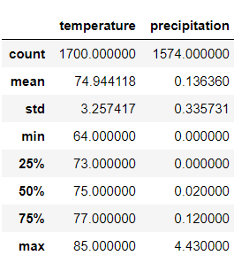
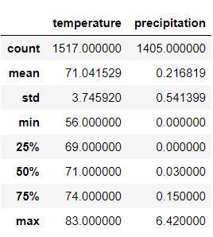
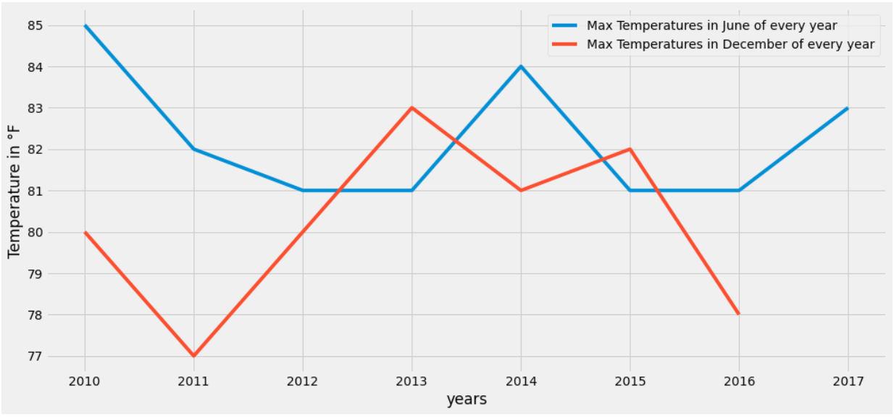
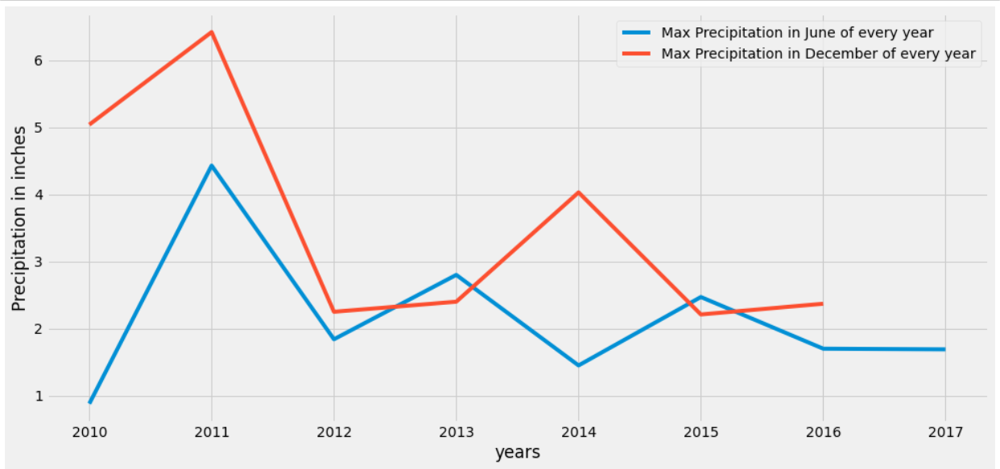

# surfs_up
## Analysis of weather data in Oahu. 
The result of the temperature and the precipitation data for the months of June and December for all the years from all the stations using the describe function is given below.

As can be seen the difference is not too drastic in both temperature and precipitation.This could infact be true or could be because the result of outliers. There are always outliers and years that are too hot or too cold in terms of climate. To combat this issue, we could opt an analysis that measures the max temperature for each year in the month of june and December for all stations and compares them. This could also be plotted. This would look something like below. 

The graphs above take the maximum points of temperature and precipitation respectively in the months of June and December of every year and plot them together for a better understanding. Doing so eliminates the possibility of the variations from ceratain years since each year is treated differently. Similarly the average and minimum can also be taken for such a graph to get a better understanding of the highs and lows of both temperature and precipitation. By doing so data points are not ignored and a more detailed analysis can be done. 

### Results

From the analysis that we have done it is obvious that June has a hotter temperature than December and the December has much more rain than June. This implies that tourists will be prone to visit around June rather than December and hence there would be more customers around June and business might be slow around December. After all due to the nature of the business hotter days definitely will attract more customers than rainy days. 

### Recomendations for further Analysis 

This analysis can be expanded to look at all months instead of just June and December to get a better idea about the times there would be more customers and the times there might be less. To do this the same approach can be taken but now instead of 2 we would have 12 months. 

Another considerations to take into account is the stations that we are obtaining data from. The data taken is probably going to be more accurate the closer the station is to Oahu. So using that station would give us the closest analysis we need. 
